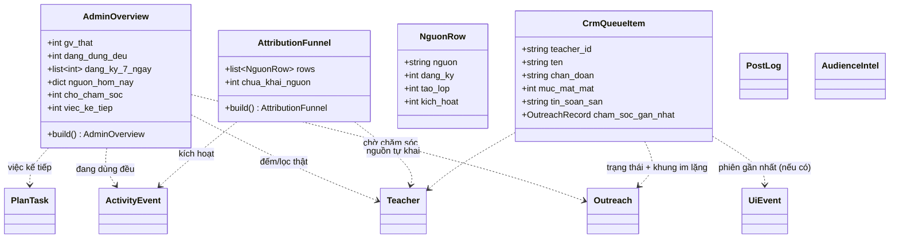

# Admin Suite Domain (Stage 2 — BUC-UNIFIED-ADMIN-OPERATIONS)

Thiết kế cho hệ admin thống nhất. Nguyên tắc chi phối: **hai domain mới đều là READ
MODEL** — tổng hợp từ bảng sẵn có, không sinh bảng mới, không sự kiện. Phần ghi duy
nhất (chăm sóc, đánh dấu việc) tái dùng nghiệp vụ đã có và đã kiểm thử
(`cham_soc.ghi`, `gtm_plan.mark`). Lý do: mọi nguồn sự thật đã tồn tại và đang được
Telegram dùng — sinh thêm bảng là sinh thêm chỗ lệch (vi phạm BR1 "một sổ nhiều cửa").

## Class Diagram

## AdminOverview (read model — MỚI)

Một màn trả lời "hôm nay có gì cần tôi". Hợp thành từ 4 nguồn, **một lượt gọi**.

### Attributes

| Attribute | Type | Required | Description |
|-----------|------|----------|-------------|
| gv_that | int | Yes | Số giáo viên thật (qua bộ lọc `is_real` hiện có) |
| dang_dung_deu | int | Yes | Làm ≥1 hành động lõi trong 7 ngày (định nghĩa North Star hiện có) |
| dang_ky_7_ngay | list[int] | Yes | 7 phần tử, theo ngày VN, cũ → mới |
| nguon_hom_nay | dict[str,int] | Yes | Đăng ký hôm nay gộp theo `teacher.source` (kể cả `chua_khai`) |
| cho_cham_soc | int | Yes | Kích thước hàng đợi CRM sau khi trừ khung im lặng |
| viec_ke_tiep | int | Yes | Số việc GTM trạng thái todo/doing |
| yen_ang | bool | Yes | BR "ngày không biến động" — frontend hiện thông điệp thay bảng |

### Methods

| Method | Parameters | Returns | Description |
|--------|------------|---------|-------------|
| build | session_factory | AdminOverview | Tổng hợp 4 nguồn; mọi nhánh lỗi trả giá trị an toàn + cờ lỗi bộ phận (AC6) |

### Business Rules

| Rule | Description | Enforcement |
|------|-------------|-------------|
| BR4 | Chỉ chứa số dẫn tới hành động; không thêm chỉ số trưng bày | Thiết kế attribute cố định |
| BR7 | Nguồn dữ liệu rỗng → trường tương ứng kèm cờ `thieu_du_lieu`, không trả 0 mập mờ | build() |

## AttributionFunnel (read model — MỚI)

Bảng quyết định quảng cáo: mỗi nguồn tự khai một dòng phễu.

### Attributes

| Attribute | Type | Required | Description |
|-----------|------|----------|-------------|
| rows | list[NguonRow] | Yes | Mỗi nguồn (`fb_ads`, `fb_group`, `gioi_thieu`, `store_search`, `khac`) một dòng |
| chua_khai_nguon | int | Yes | Người thật không có source — hiển thị TÁCH RIÊNG, không trộn vào "khác" |

### NguonRow

| Attribute | Type | Required | Description |
|-----------|------|----------|-------------|
| nguon | string | Yes | Mã nguồn tự khai |
| dang_ky | int | Yes | Số GV thật mang nguồn này |
| tao_lop | int | Yes | Trong đó đã tạo ≥1 lớp |
| kich_hoat | int | Yes | Trong đó đã chạm ≥1 hành động lõi |

### Business Rules

| Rule | Description | Enforcement |
|------|-------------|-------------|
| BR5 | Chỉ đọc `teacher.source` — không suy diễn nguồn từ bất kỳ tín hiệu nào khác | build() chỉ SELECT, không heuristic |
| — | `chua_khai_nguon` tách riêng vì trộn vào "khác" sẽ thổi phồng một nguồn thật | Cấu trúc output |

## CrmQueueItem (composition — TÁI DÙNG)

Không viết logic mới: hàng đợi = `user_health.user_list` (chẩn đoán) × `viec_hom_nay._uu_tien`
(xếp hạng) × `viec_hom_nay._tin_nhan` (tin soạn sẵn) × `cham_soc.dang_im_lang` (ẩn/hiện).
Việc duy nhất của Stage 4 là **tách các hàm này ra khỏi module bản tin** thành service
dùng chung (`crm.py`) để Telegram và admin cùng import — đúng BR1.

### Methods

| Method | Parameters | Returns | Description |
|--------|------------|---------|-------------|
| queue | session_factory | list[CrmQueueItem] | Danh sách đã lọc im lặng + xếp mất mát |
| act | teacher_id, kind | bool | Uỷ quyền `cham_soc.ghi` — idempotent theo EF2 của BUC |

## Ranh giới & API contract (một router mới `admin_suite.py`)

| Endpoint | Read model / service | Ghi chú |
|---|---|---|
| `GET  /admin/suite/overview` | AdminOverview.build | Khu Tổng quan |
| `GET  /admin/suite/crm` | CrmQueueItem.queue | Khu CRM |
| `POST /admin/suite/crm/act` | CrmQueueItem.act | 4 hành động BR3 |
| `GET  /admin/suite/attribution` | AttributionFunnel.build | Khu Marketing |
| `GET  /admin/journey?teacher_id=` | (đã có) | Khu Hành trình — giữ nguyên |
| `GET  /admin/suite/strategy` | gtm_plan (đã có) + AudienceIntel proxy | Khu Chiến lược & Lắng nghe |

AudienceIntel nằm ở DB hệ marketing → backend DayThem **proxy qua HTTP nội bộ** (cùng
mẫu funnel_bridge chiều ngược lại), tuyệt đối không nối chéo hai DB.

## Frontend

Một trang `admin/suite.html` (server-served như `users.html`, không SPA build-step) —
5 khu tải độc lập bằng fetch riêng (AC6), giữ ngôn ngữ thiết kế `users.html` hiện có.
Trang `users.html`/`ops.html` cũ giữ nguyên URL một thời gian, gắn banner trỏ về trang mới.
