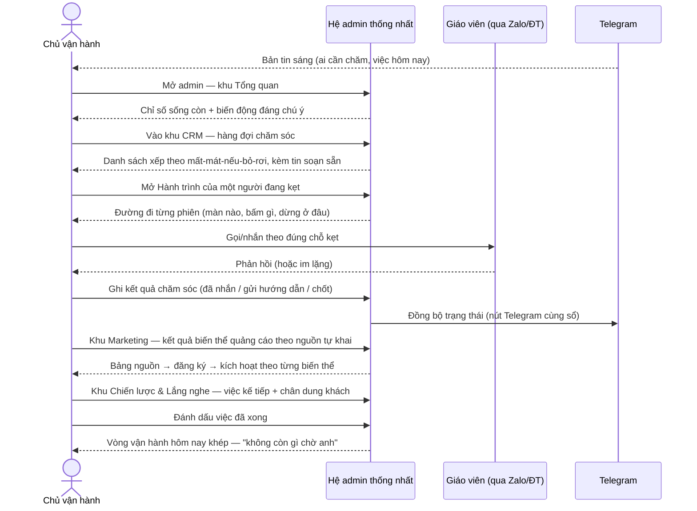

# BUC-UNIFIED-ADMIN-OPERATIONS: Vận hành GieoChữ qua một hệ admin thống nhất

**Use Case ID:** BUC-UNIFIED-ADMIN-OPERATIONS (derived from: `use_cases/business/unified-admin-operations.md`)
**Use Case Name:** Vận hành hằng ngày qua hệ admin thống nhất (Dashboard · CRM · Marketing · Strategy · Listening)
**Version:** 1.0
**Date:** 2026-09-01
**Status:** Draft

---

## Brief Description

Chủ vận hành GieoChữ (một người) hiện phải đảo qua **7 mặt phẳng rời rạc** (trang người
dùng, cockpit vận hành, dashboard marketing, trang kế hoạch ngày, bản tin Telegram,
Play/App Store console, log server) để trả lời bốn câu hỏi lặp lại mỗi ngày: *hôm nay ai
cần chăm sóc, từng người đang bấm gì trong app, kênh marketing nào đang ra khách, và việc
chiến lược nào tới lượt.* Chi phí thật là **sự chú ý** — mỗi lần đổi mặt phẳng là một lần
mất mạch.

Use case này hợp nhất toàn bộ vòng vận hành vào **một giao diện admin duy nhất** với năm
khu: **Tổng quan** (chỉ số sống còn), **CRM** (hàng đợi chăm sóc — cùng cơ chế với nút bấm
Telegram hiện tại, hai nơi một sổ), **Hành trình** (từng người dùng đang ấn vào đâu, làm
gì — dữ liệu bước chân từ bản app 1.0.1), **Marketing** (bài đã đăng, biến thể quảng cáo
nào thắng, nguồn khách), và **Chiến lược & Lắng nghe** (việc kế tiếp theo kế hoạch GTM +
chân dung/ngôn ngữ khách từ các lần quét). Người hưởng lợi trực tiếp là chủ vận hành
(một buổi sáng 15 phút thay vì rải rác cả ngày); gián tiếp là giáo viên — được chăm sóc
đúng lúc, đúng chỗ kẹt.

---

## Actors

| Actor | Type | Description |
|-------|------|-------------|
| **Chủ vận hành** | Primary | Người duy nhất vận hành GieoChữ: quyết định chăm sóc ai, đọc số, chốt việc chiến lược |
| **Giáo viên** | Supporting | Người dùng app — hành vi của họ (bước chân, kích hoạt, nguồn đến) là dữ liệu đầu vào; họ nhận tin chăm sóc qua Zalo/điện thoại/push |
| **Hệ GieoChữ** | System | Nền tảng: thu bước chân từ app, tính sức khoẻ người dùng, giữ sổ chăm sóc, sổ bài đăng, kế hoạch, kho lắng nghe |
| **Telegram** | System | Kênh đẩy: bản tin sáng + nút thao tác nhanh — phải đồng bộ hai chiều với khu CRM |
| **Facebook** | System | Nơi chạy quảng cáo/bài đăng — kết quả được đối chiếu qua nguồn tự khai của giáo viên |

---

## Preconditions

1. Chủ vận hành đã đăng nhập admin (phiên quản trị hợp lệ)
2. App phiên bản có đo bước chân (≥1.0.1) đã tới tay ít nhất một phần người dùng
3. Bản tin/bot Telegram đang hoạt động (kênh đẩy song song)
4. Dữ liệu nền tồn tại: người dùng thật, sổ chăm sóc, kế hoạch GTM, kho lắng nghe (có thể rỗng — hệ phải nói thẳng "chưa có dữ liệu", không hiện bảng trống vô nghĩa)

---

## Postconditions

### Success Postconditions
1. Mọi người dùng đang kẹt đều có trạng thái chăm sóc rõ (đã nhắn / đã gửi hướng dẫn / chốt xong / bỏ) — ghi một lần, Telegram và admin cùng thấy
2. Chủ vận hành trả lời được "từng người đang ấn vào đâu" bằng đường đi từng phiên, không phải đoán
3. Quyết định marketing (biến thể thắng, kênh dồn tiền) được chốt trên số nguồn-tự-khai, không trên cảm giác
4. Việc chiến lược tới lượt được đánh dấu tiến độ

### Failure Postconditions
1. Khu nào lỗi thì khu đó báo lỗi tại chỗ — các khu còn lại vẫn dùng được (không sập cả trang)
2. Thao tác ghi (chăm sóc, đánh dấu việc) thất bại phải báo ngay tại nút bấm, không ghi nửa vời
3. Không mất dấu trạng thái đã ghi trước đó

---

## Main Success Scenario

### Sequence Diagram



### Step-by-Step Flow

| Step | Actor | Action | Details |
|------|-------|--------|---------|
| **1** | **Telegram** | Đẩy bản tin sáng | • Ai cần chăm sóc (xếp theo mất mát) kèm tin soạn sẵn<br>• Nút một chạm: **đã nhắn** \| **họ hỏi cách** |
| **2** | **Chủ vận hành** | Mở khu Tổng quan | • Xem: GV thật · đang dùng đều · đăng ký 7 ngày · nguồn hôm nay<br>• Mỗi con số bấm vào được để xuống chi tiết |
| **3** | **Chủ vận hành** | Làm hàng đợi CRM | • Danh sách người kẹt + **chẩn đoán** (kẹt ở đâu) + tin soạn sẵn copy-một-chạm<br>• Chọn hành động: **đã nhắn** \| **gửi hướng dẫn** \| **chốt xong** \| **bỏ theo dõi** |
| **4** | **Hệ GieoChữ** | Ghi sổ chăm sóc | • Một sổ duy nhất — Telegram và admin đọc/ghi chung<br>• Người đã nhắn tự ẩn khỏi hàng đợi trong khung im lặng, quá hạn tự hiện lại |
| **5** | **Chủ vận hành** | Soi Hành trình một người | • Đường đi từng phiên: mở màn nào → bấm gì → **dừng ở đâu**<br>• Bảng "ngõ cụt": màn nào hay là điểm dừng cuối toàn hệ |
| **6** | **Chủ vận hành** | Đọc khu Marketing | • Bài đã đăng (tự ghi khi copy) + kết quả biến thể quảng cáo<br>• Phễu theo **nguồn tự khai**: nguồn → đăng ký → tạo lớp → kích hoạt |
| **7** | **Chủ vận hành** | Chốt Chiến lược & Lắng nghe | • 3 việc kế tiếp theo kế hoạch GTM, đánh dấu **xong** \| **đang làm** \| **bỏ**<br>• Chân dung + **ngôn ngữ nguyên văn** của khách từ lần quét gần nhất, kèm ngày quét |
| **8** | **Hệ GieoChữ** | Khép vòng | • Khi hàng đợi rỗng và việc hôm nay xong: hiện rõ "không còn gì chờ anh"<br>• Trạng thái nhất quán trên cả admin lẫn Telegram |

---

## Alternative Flows

### Alternative Flow 1: Vận hành thuần qua Telegram (không mở admin)
**Trigger:** Bước 2 — chủ vận hành đang di chuyển, chỉ có điện thoại

**Flow:**
- 2a. Toàn bộ thao tác chăm sóc làm bằng nút bấm trên bản tin Telegram
- 2b. Sổ chăm sóc ghi y hệt như thao tác trên admin (một sổ, hai cửa)
- 2c. Lần mở admin kế tiếp phản ánh đúng mọi thao tác đã làm qua Telegram — kết thúc use case

### Alternative Flow 2: Chưa có dữ liệu bước chân của người cần soi
**Trigger:** Bước 5 — người dùng còn chạy bản app cũ (trước 1.0.1)

**Flow:**
- 5a. Khu Hành trình nói thẳng: "chưa có bước chân — người này chưa lên bản app mới", kèm hành vi thay thế (hành động lõi gần nhất)
- 5b. Chủ vận hành quay lại bước 3 chăm sóc bằng dữ liệu hành động lõi

### Alternative Flow 3: Ngày không có biến động
**Trigger:** Bước 2 — không ai kẹt, không đăng ký mới

**Flow:**
- 2a. Tổng quan hiện "hôm nay yên ắng" + một gợi ý duy nhất từ kế hoạch GTM
- 2b. Use case kết thúc trong dưới một phút — hệ không bịa việc để trông bận rộn

---

## Exception Flows

### Exception 1: Một khu không tải được dữ liệu
**Trigger:** Bất kỳ bước nào — nguồn dữ liệu của một khu lỗi

**Flow:**
- Khu lỗi hiện thông báo tại chỗ, nêu rõ khu nào và thử lại được
- Các khu còn lại hoạt động bình thường (không sập cả trang)
- Use case tiếp tục ở các khu khác

### Exception 2: Ghi trạng thái chăm sóc thất bại
**Trigger:** Bước 3/4 — mạng gián đoạn khi bấm nút

**Flow:**
- Nút báo lỗi ngay tại chỗ, trạng thái KHÔNG đổi trên giao diện (không giả vờ thành công)
- Chủ vận hành bấm lại; ghi lặp phải vô hại (không tạo hai bản ghi cho một lần nhắn)

---

## Business Rules

### BR1: Một sổ chăm sóc, nhiều cửa
- **Rule:** Trạng thái chăm sóc mỗi giáo viên chỉ có MỘT nguồn sự thật; Telegram và admin là hai cửa của cùng sổ đó
- **Rationale:** Hai sổ lệch nhau là nhắn trùng người — phiền giáo viên và mất lòng tin vào chính hệ thống
- **Enforcement:** Mọi cửa ghi qua cùng một nghiệp vụ chăm sóc (Bước 4)

### BR2: Hàng đợi xếp theo mất mát, không theo mới-cũ
- **Rule:** Người đã bỏ nhiều công sức mà kẹt/im lặng đứng trước người mới bấm một phút; người đang khoẻ không nằm trong hàng đợi cứu hộ
- **Rationale:** Mất một người đã nhập 30 học sinh đắt hơn nhiều mất một người vãng lai
- **Enforcement:** Quy tắc xếp hạng tại Bước 3 (đã kiểm chứng ở bản tin Telegram hiện tại)

### BR3: Đã nhắn thì im — quá hạn thì tự nổi lại
- **Rule:** Người vừa được nhắn ẩn khỏi hàng đợi trong khung im lặng cố định; hết khung mà không có chuyển biến thì tự hiện lại
- **Rationale:** Ngắn hơn thành giục; dài hơn thì nguội; và không ai bị bỏ rơi vĩnh viễn
- **Enforcement:** Bước 4

### BR4: Chỉ số hành động đứng trước chỉ số phù phiếm
- **Rule:** Mọi khu ưu tiên trả lời "làm gì tiếp theo"; con số không dẫn tới hành động không được chiếm màn hình đầu
- **Rationale:** Bài học đã trả giá: bản tin 40 dòng chỉ số bị bỏ qua, bản 20 dòng việc thì được dùng
- **Enforcement:** Thiết kế từng khu (Bước 2–7)

### BR5: Nguồn khách là dấu chân đầu tiên, bất biến
- **Rule:** Nguồn tự khai của giáo viên ghi một lần duy nhất, không thao tác nào về sau đè được
- **Rationale:** Attribution đổi được thì mọi so sánh biến thể quảng cáo thành vô nghĩa
- **Enforcement:** Nghiệp vụ hồ sơ (đã có, kèm kiểm thử)

### BR6: Bước chân không chứa nội dung dạy học
- **Rule:** Dữ liệu hành trình chỉ gồm tên màn và tên nút; tuyệt đối không tên học sinh, số tiền, tin nhắn phụ huynh
- **Rationale:** Riêng tư của giáo viên và học sinh là ranh giới không thương lượng; đồng thời khớp khai báo Data safety/App Privacy đã nộp
- **Enforcement:** Điểm thu bước chân phía app + kiểm duyệt dữ liệu vào

### BR7: Không có dữ liệu thì nói thẳng
- **Rule:** Khu thiếu dữ liệu phải nói "chưa có + vì sao + cách có" — không hiện bảng rỗng hay số 0 mập mờ
- **Rationale:** Chủ vận hành từng mất nhiều buổi vì tưởng "0" nghĩa là hệ hỏng
- **Enforcement:** Trạng thái rỗng của từng khu

---

## Data Requirements

### Input Data (thao tác của chủ vận hành)

| Field | Type | Required | Validation | Example |
|-------|------|----------|------------|---------|
| hanh_dong_cham_soc | Enum | Yes | nhan \| huong \| xong \| bo | "nhan" |
| teacher_id | UUID | Yes | Người dùng thật, tồn tại | "t-..." |
| trang_thai_viec | Enum | Yes | done \| doing \| skip \| todo | "done" |
| ma_viec | String | Yes | Có trong kế hoạch GTM | "interview-3" |

### Output Data

**Tổng quan (một màn):**
```json
{
  "gv_that": 12, "dang_dung_deu": 2,
  "dang_ky_7_ngay": [0,1,1,0,0,0,1],
  "nguon_hom_nay": {"fb_ads": 0, "fb_group": 1, "khac": 0},
  "cho_cham_soc": 5, "viec_ke_tiep": 3
}
```

**Một dòng hàng đợi CRM:**
```json
{
  "teacher_id": "t-…", "ten": "Ms Meila",
  "chan_doan": "đã có lớp và 30 HS nhưng chưa điểm danh",
  "muc_mat_mat": 1, "tin_soan_san": "Chào Ms Meila ạ…",
  "cham_soc_gan_nhat": {"kind": "nhan", "ngay": "2026-08-25"}
}
```

**Một phiên hành trình:**
```json
{
  "session_id": "…", "bat_dau": "…", "giay": 67,
  "buoc": ["Home", "Classes", "CreateClass · tạo lớp"],
  "mo_roi_thoat": false
}
```

---

## Success Criteria

1. **Một cửa thay bảy cửa** — vòng vận hành sáng hoàn tất không rời khỏi admin (trừ hành động nhắn Zalo/gọi vốn dĩ ở ngoài)
2. **CRM hai cửa một sổ** — thao tác trên Telegram và trên admin cho cùng kết quả, thấy lẫn nhau tức thì
3. **Trả lời được "người này đang ấn gì"** cho mọi người dùng đã lên 1.0.1, tới từng phiên
4. **Quyết định quảng cáo bằng số** — bảng biến thể → nguồn tự khai → kích hoạt đọc được trong một màn
5. **Trạng thái rỗng trung thực** ở cả năm khu

---

## Acceptance Criteria

### Functional
**AC1: Tổng quan** — ✅ đủ 5 chỉ số hành động; ✅ mỗi số bấm được xuống chi tiết; ✅ "hôm nay yên ắng" khi không biến động
**AC2: CRM** — ✅ hàng đợi xếp theo BR2; ✅ 4 hành động ghi sổ chung với Telegram; ✅ ẩn/hiện lại theo BR3; ✅ ghi lặp vô hại
**AC3: Hành trình** — ✅ đường đi từng phiên đúng thứ tự thời gian; ✅ gộp mở-lại-liên-tiếp; ✅ bảng ngõ cụt; ✅ thông điệp rõ khi người dùng chưa lên 1.0.1
**AC4: Marketing** — ✅ bảng nguồn → đăng ký → kích hoạt; ✅ sổ bài đăng hiện đúng bài đã copy; ✅ so sánh biến thể quảng cáo theo nguồn
**AC5: Chiến lược & Lắng nghe** — ✅ 3 việc kế tiếp + đánh dấu tiến độ; ✅ chân dung/ngôn ngữ nguyên văn kèm ngày quét

### Non-Functional
**AC6: Bền vững từng khu** — ✅ một khu lỗi không sập trang; lỗi hiện tại chỗ, thử lại được
**AC7: Hiệu năng** — ✅ mỗi khu tải dưới 2 giây với dữ liệu hiện tại; ✅ không truy vấn N+1 theo số người dùng
**AC8: Bảo mật** — ✅ toàn bộ sau đăng nhập admin; ✅ bước chân không chứa nội dung dạy học (BR6)
**AC9: Quan sát được** — ✅ thao tác ghi có log; ✅ lỗi kèm ngữ cảnh đủ chẩn đoán

---

## Required Domain Operations

| Step | Domain UC | Aggregate | Link | Hiện trạng |
|------|-----------|-----------|------|-----------|
| 2 | Tổng hợp chỉ số vận hành | AdminOverview (read model) | [DUC-ADM-OVERVIEW](../domain/admin-overview/get.md) | **Mới** |
| 3 | Liệt kê hàng đợi chăm sóc | Outreach + UserHealth | [DUC-OUT-QUEUE](../domain/outreach/queue.md) | Một phần (bản tin Telegram) |
| 4 | Ghi hành động chăm sóc | Outreach | [DUC-OUT-RECORD](../domain/outreach/record.md) | **Đã có** (`cham_soc.ghi`) |
| 5 | Xem hành trình một người | UiEvent | [DUC-UIE-SESSIONS](../domain/ui-event/sessions.md) | **Đã có** (`journey.sessions_of`) |
| 5 | Bảng ngõ cụt | UiEvent | [DUC-UIE-DROPOFF](../domain/ui-event/drop-off.md) | **Đã có** (`journey.drop_off`) |
| 6 | Phễu theo nguồn tự khai | Teacher + ActivityEvent | [DUC-TCH-ATTRIBUTION](../domain/teacher/attribution.md) | **Mới** |
| 6 | Sổ bài đăng | PostLog | [DUC-PLG-LIST](../domain/post-log/list.md) | **Đã có** (`/admin/postlog`) |
| 7 | Việc kế tiếp + đánh dấu | PlanTask | [DUC-PLN-TASKS](../domain/plan-task/list-mark.md) | **Đã có** (`gtm_plan`) |
| 7 | Kho lắng nghe | AudienceIntel | [DUC-AIN-LIST](../domain/audience-intel/list.md) | Một phần (DB marketing) |

---

## Related Use Cases

- **BUC-COLLECT-TUITION / BUC-MARK-ATTENDANCE** — nguồn phát sinh hành động lõi mà khu Hành trình/CRM đọc
- Bản tin Telegram sáng (hiện hoạt) — Alternative Flow 1 của use case này

## References

- `docs/audit-luong-toan-canh.md` — phát hiện nền về phễu và điểm rơi
- `docs/seo-tu-khoa.md` — ngữ liệu khách hàng cho khu Lắng nghe
- Quyết định chủ app 30/08: giữ nguyên điều hướng sau tạo lớp — khu Hành trình chính là nơi cung cấp số liệu để bàn lại

## Notes

### Implementation Considerations
1. **Read model trước, bảng mới sau:** Tổng quan và Phễu-theo-nguồn là read model tổng hợp từ bảng sẵn có — không sinh bảng mới nếu chưa cần
2. **Tái dùng tối đa:** hàng đợi CRM dùng đúng `_uu_tien`/`_tin_nhan` của bản tin; hành trình dùng `journey.py`; một nguồn logic, hai mặt hiển thị
3. **Frontend một trang, năm khu** — mỗi khu tải độc lập (AC6); giữ đúng ngôn ngữ thiết kế `users.html`/`ops.html` hiện có để không phát sinh hệ style thứ ba

---

**Document Version:** 1.0 · **Last Updated:** 2026-09-01 · **Next Review:** sau khi hoàn thành Stage 2 (design-domain)
