# DayThem — UX Flows & Sequence Diagrams

> Phiên bản: v1.0 · Ngày: 2026-05-22  
> Notation: `Teacher` = giáo viên dùng app · `App` = React Native client · `API` = backend REST

---

## Flow 1 — Onboarding & Đăng nhập

### 1.1 Đăng nhập lần đầu (Google / Facebook)

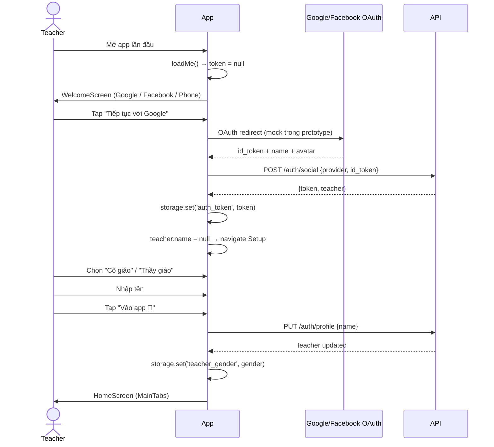

### 1.2 Đăng nhập bằng số điện thoại (OTP)

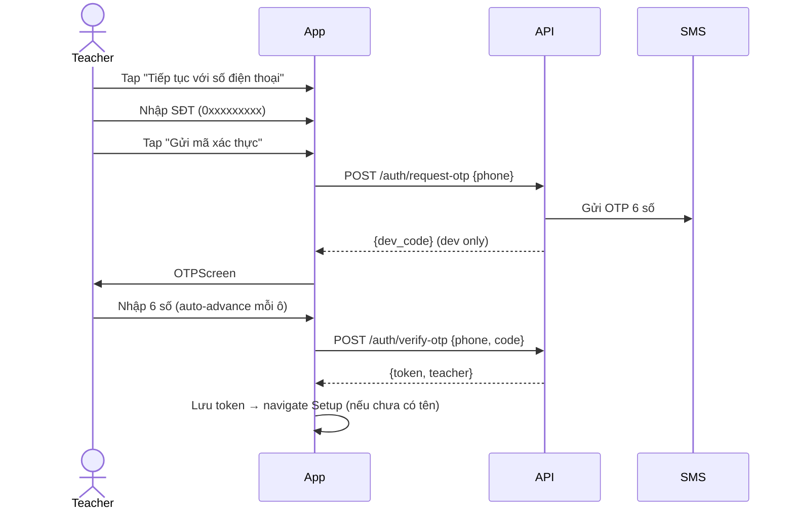

---

## Flow 2 — Quản lý Lớp học (CLS)

### 2.1 Tạo lớp mới

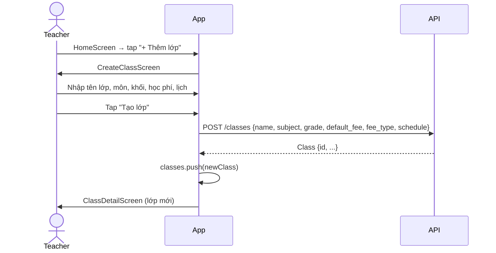

### 2.2 Xem chi tiết lớp & điều hướng

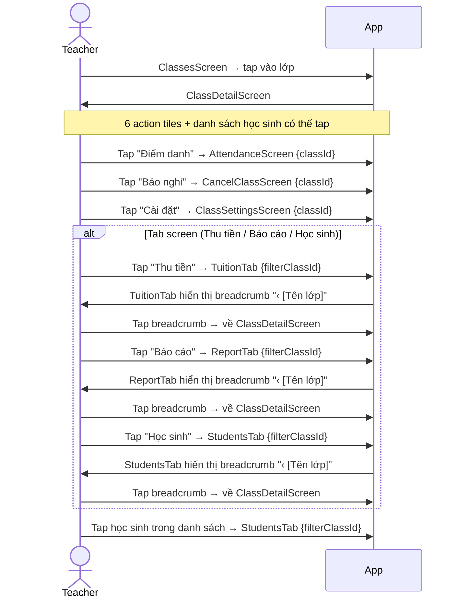

> **Quy tắc breadcrumb:** Breadcrumb `‹ [Tên lớp]` chỉ hiện khi API backend hoạt động (class tồn tại trong store). Trong chế độ demo, breadcrumb ẩn vì không có class thật để quay về. Lọc `filterClassId` được fallback về `'all'` nếu ID không khớp dữ liệu hiện tại.

### 2.3 Cài đặt lớp học (ClassSettings)

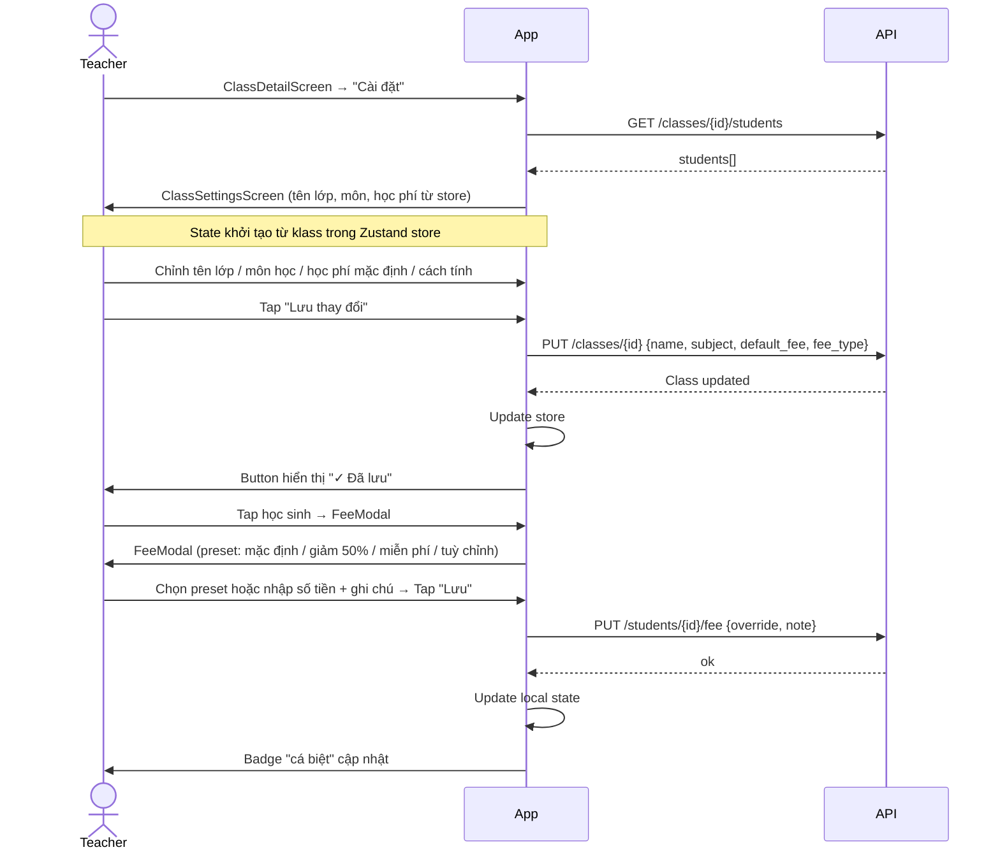

### 2.4 Thêm học sinh trực tiếp từ ClassDetail

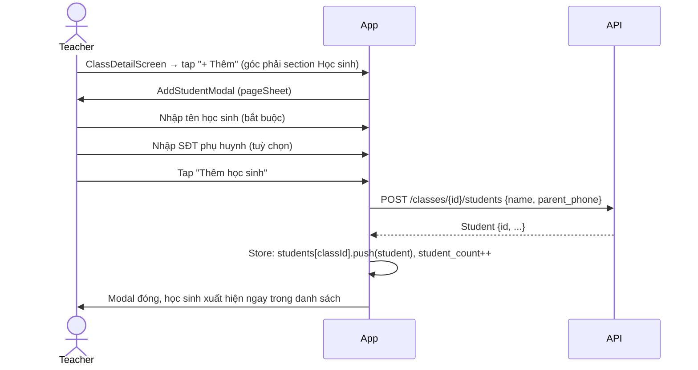

---

## Flow 3 — Điểm danh (ATT)

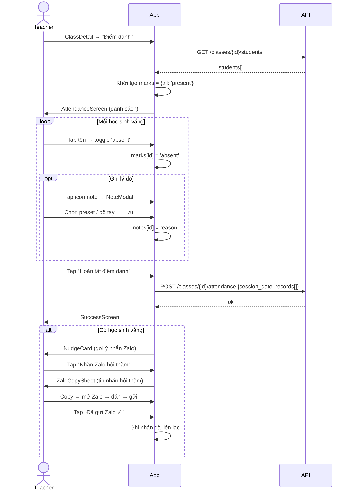

---

## Flow 4 — Thu học phí (TUI)

### 4.1 Xem & tick đã thu

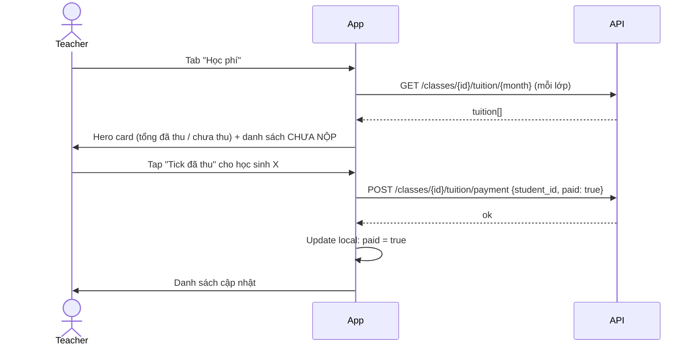

### 4.2 Gửi nhắc học phí qua Zalo

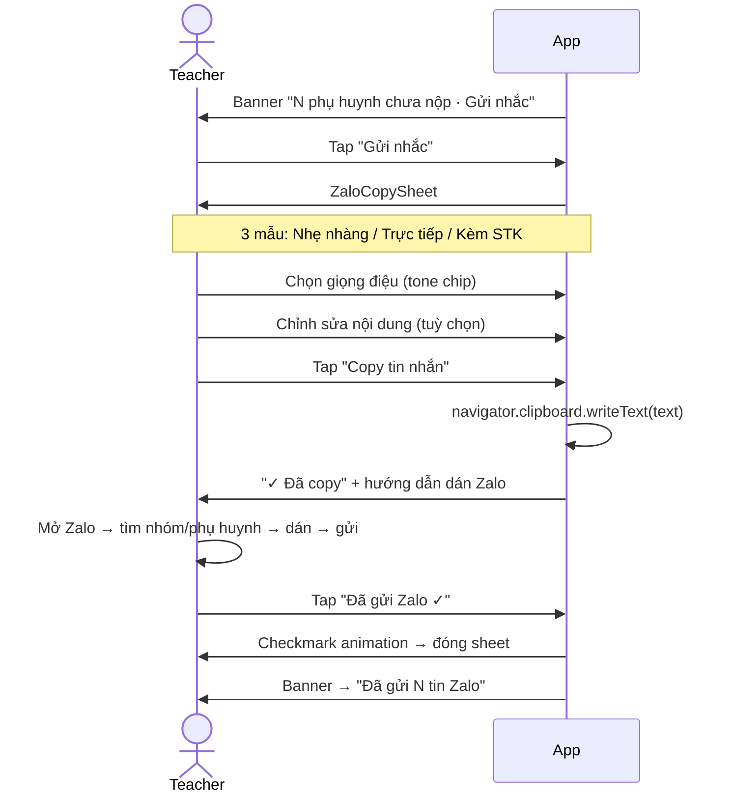

---

## Flow 5 — Báo nghỉ & Học bù (ANN)

### 5.1 Báo nghỉ

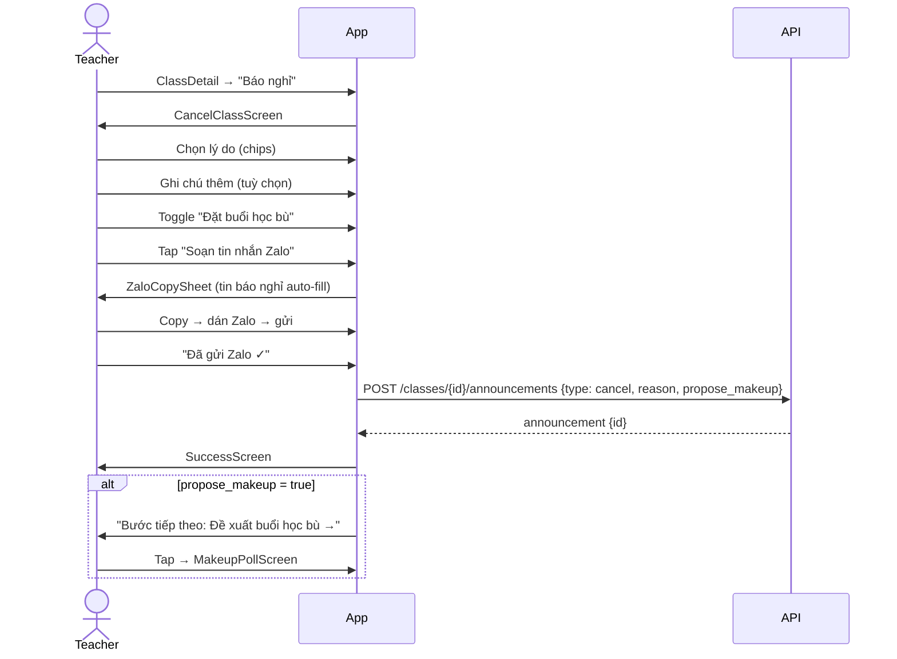

### 5.2 Đề xuất học bù (Makeup Poll)

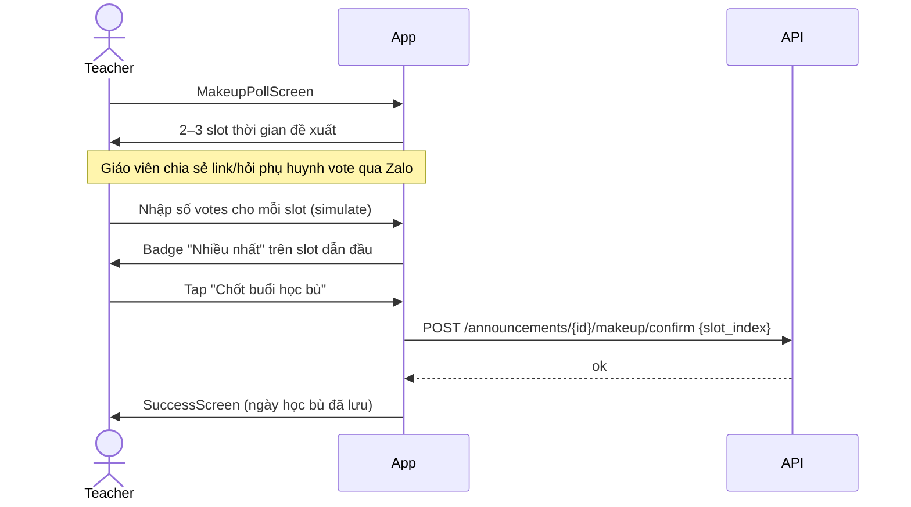

---

## Flow 6 — Báo cáo tuần (RPT)

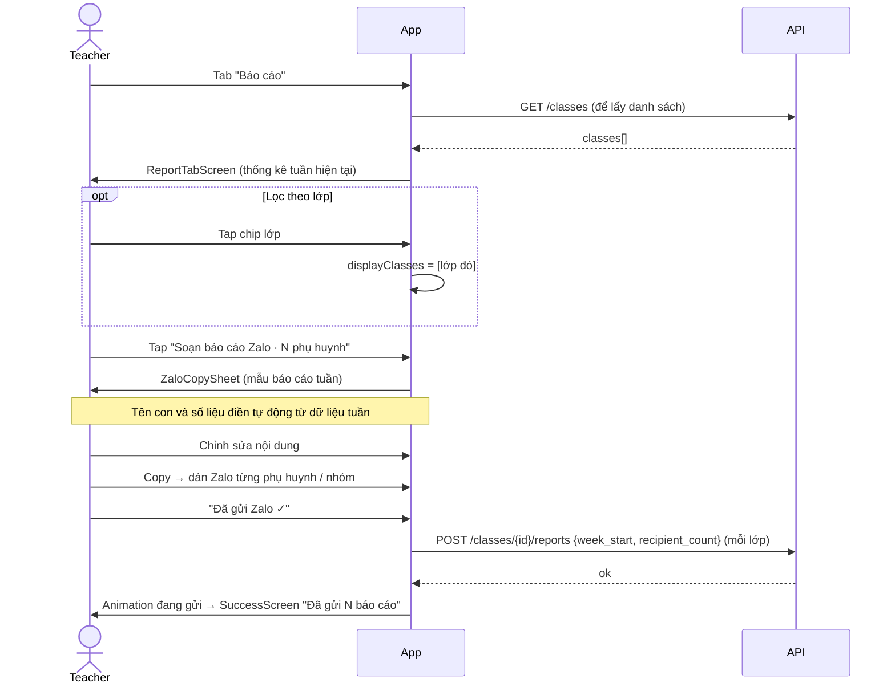

---

## Flow 7 — Quản lý Học sinh (STU)

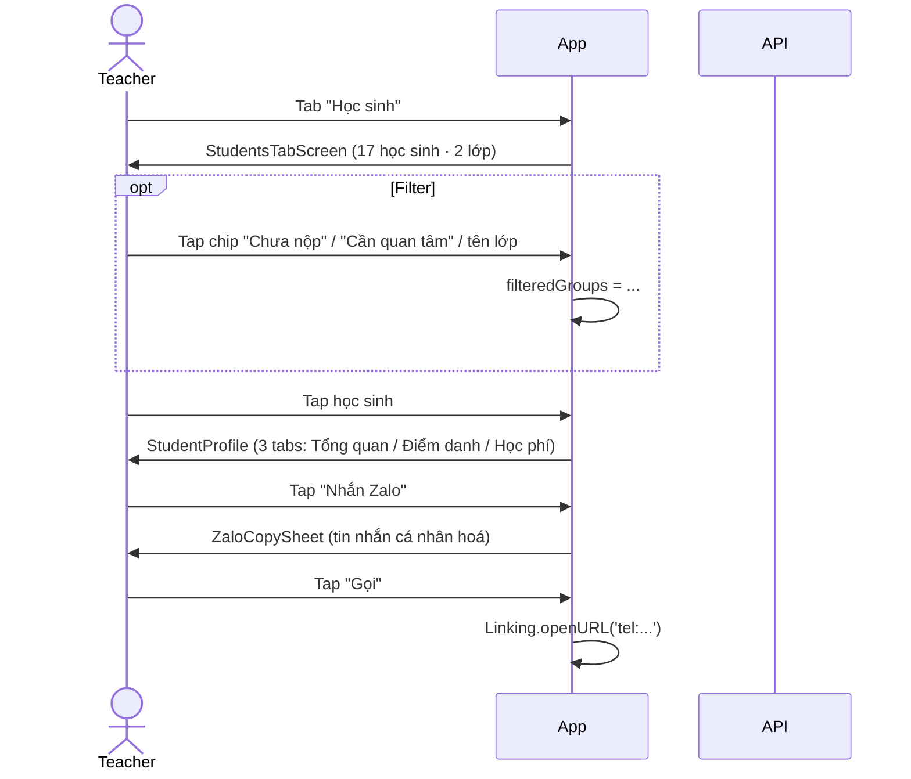

---

## Flow 8 — Lịch & Tổng quan (Home + Calendar)

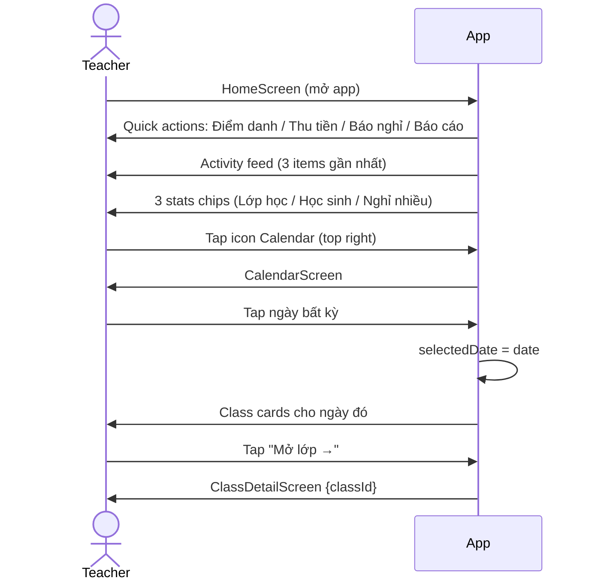

---

## Screen Inventory

| Screen | Path | Trigger |
|--------|------|---------|
| WelcomeScreen | `/Auth/WelcomeScreen` | Chưa đăng nhập |
| OTPScreen | `/Auth/OTPScreen` | Đăng nhập SĐT |
| SetupScreen | `/Auth/SetupScreen` | Đã đăng nhập, chưa có tên |
| HomeScreen | `MainTabs/Home` | Default sau login |
| CalendarScreen | `Stack/Calendar` | Icon lịch ở Home |
| ClassesScreen | `MainTabs/Classes` | Tab "Lớp học" |
| ClassDetailScreen | `Stack/ClassDetail` | Tap lớp bất kỳ |
| CreateClassScreen | `Stack/CreateClass` | FAB tạo lớp |
| ClassSettingsScreen | `Stack/ClassSettings` | Tile "Cài đặt" trong ClassDetail |
| AttendanceScreen | `Stack/Attendance` | Tile "Điểm danh" |
| CancelClassScreen | `Stack/CancelClass` | Tile "Báo nghỉ" |
| MakeupPollScreen | `Stack/MakeupPoll` | Sau báo nghỉ có học bù |
| StudentsTabScreen | `MainTabs/Students` | Tab "Học sinh" |
| TuitionTabScreen | `MainTabs/Tuition` | Tab "Học phí" |
| ReportTabScreen | `MainTabs/Reports` | Tab "Báo cáo" |
| ProfileScreen | `Stack/Profile` | Avatar ở Home |

---

## Navigation Map

```
Stack (Root)
├── WelcomeScreen
├── OTPScreen
├── SetupScreen
└── MainTabs
    ├── Tab: Home
    ├── Tab: Classes
    ├── Tab: Students        ← nhận filterClassId param
    ├── Tab: Tuition         ← nhận filterClassId param
    ├── Tab: Reports         ← nhận filterClassId param
    │
    └── Stack overlays
        ├── ClassDetail      {classId, className}
        ├── CreateClass
        ├── Attendance       {classId, className}
        ├── CancelClass      {classId, className}
        ├── MakeupPoll       {announcementId, makeupId}
        ├── ClassSettings    {classId, className}
        ├── Profile
        └── Calendar
```

**Quy tắc điều hướng:**
- Stack screen → Tab screen: `navigation.navigate('MainTabs', { screen: 'TabName', params: { filterClassId } })`
- Tab screen → Stack screen: `navigation.navigate('ScreenName', { params })`
- Back: `navigation.goBack()` hoặc nút ← hardware
