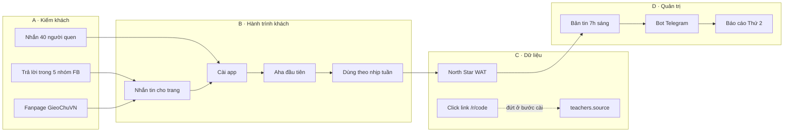
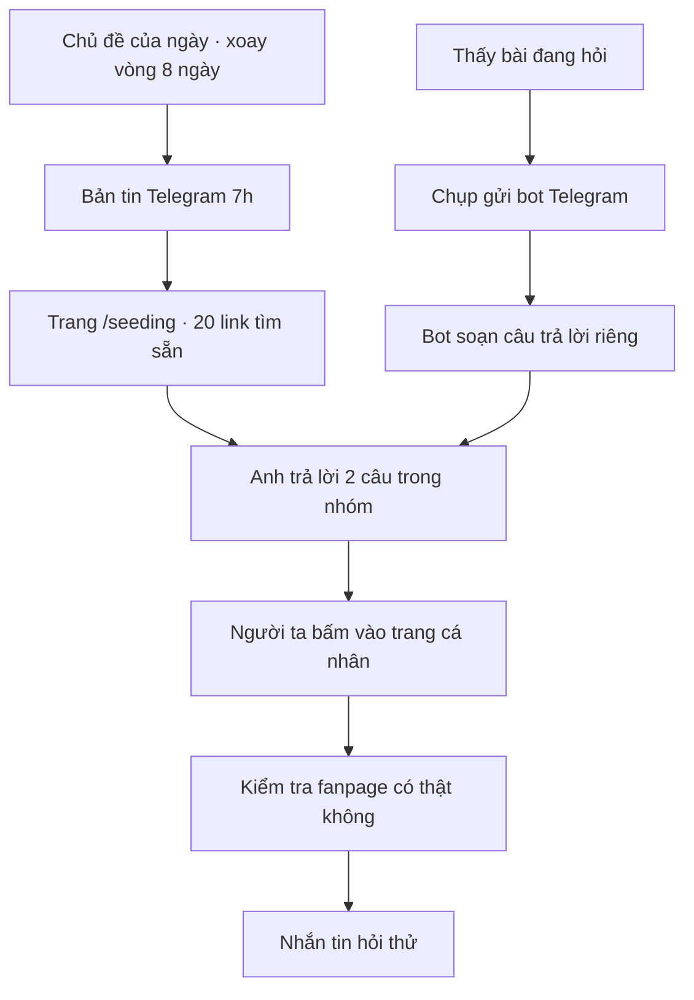
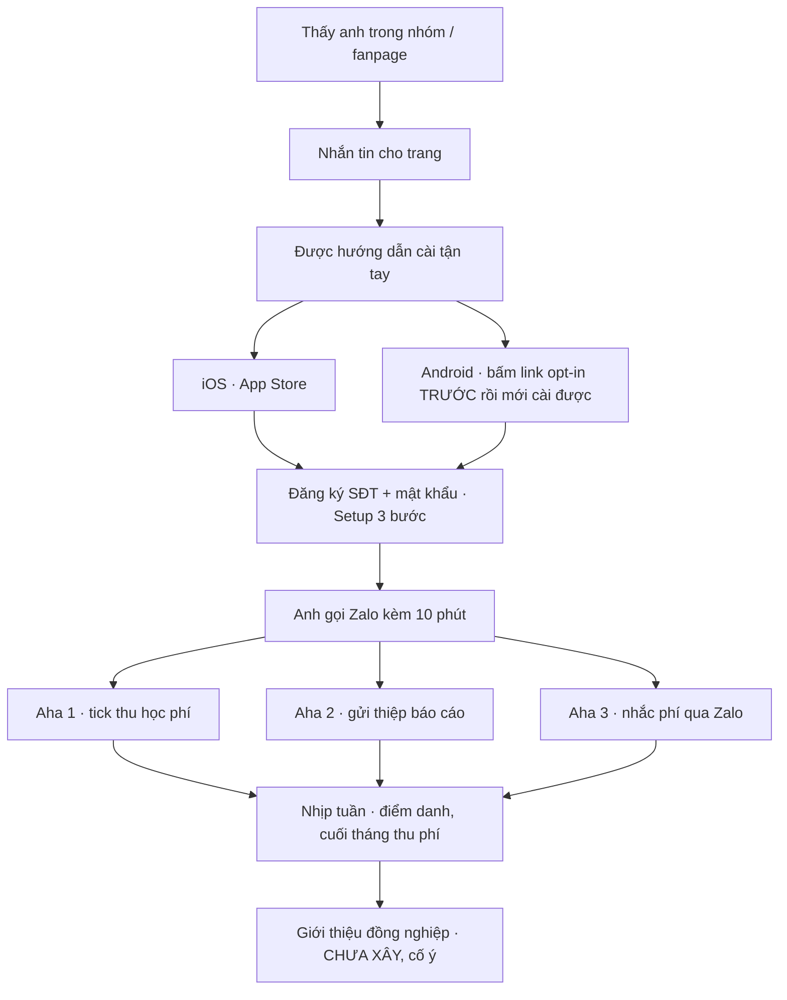
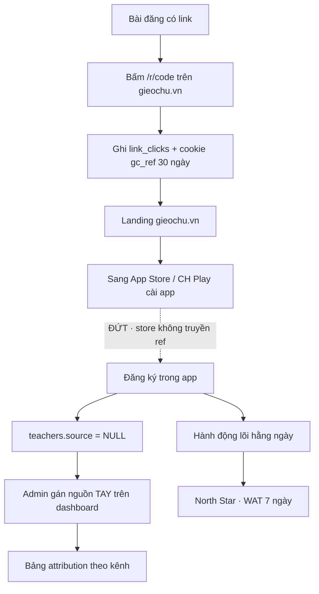
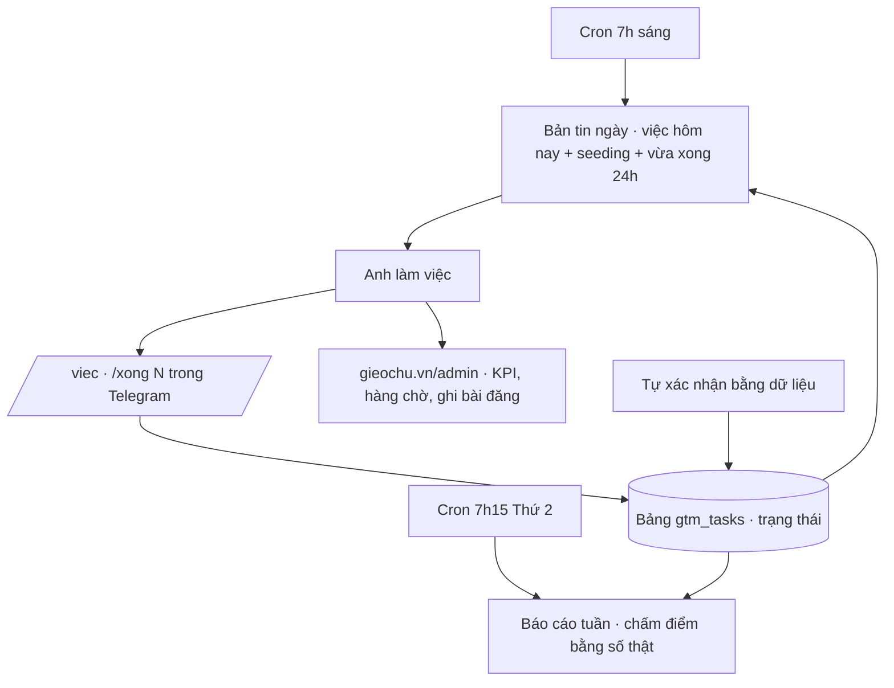
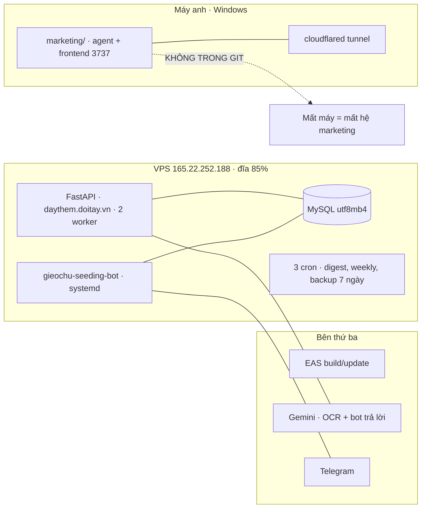

# GieoChữ — AUDIT TOÀN CẢNH: marketing → hệ thống → UX khách → quản trị

> Lập 09/08/2026. Mọi con số trong file này **đọc trực tiếp từ DB production sáng nay**,
> không lấy từ trí nhớ. Chỗ nào là suy đoán đều ghi rõ "chưa kiểm chứng".
>
> Cách đọc: mỗi luồng có sơ đồ + bảng audit từng mắt xích, chấm 🟢 chạy tốt ·
> 🟡 chạy nhưng có rủi ro · 🔴 gãy hoặc chưa tồn tại.

---

## 0. TÓM TẮT CHO NGƯỜI VỘI

**Hệ thống quản trị và sản phẩm: tốt hơn mức cần thiết. Phễu khách hàng thật: chưa mở.**

Ba con số nói hết (đọc từ prod 09/08):

| Con số | Giá trị | Nghĩa là |
|---|---|---|
| Bài đã đăng (post_logs) | **0** | Cửa vào phễu chưa mở |
| GV có nguồn kênh (source) | **0/22** | Không ai biết 22 tài khoản đến từ đâu |
| Khách hàng THẬT đang dùng | **0** | 22 tài khoản = mình + seed + dev đổi chéo |

Việc đáng làm nhất tuần này **không phải xây thêm gì** — mọi công cụ đã có.
Là **đăng bài đầu tiên và nhắn 40 người đầu tiên** (việc 2 và 3 trong `/viec`).

---

## 1. BỨC TRANH BỐN LUỒNG



---

## 2. LUỒNG A — KIẾM KHÁCH (marketing)



| Mắt xích | Trạng thái | Bằng chứng / lỗ hổng |
|---|---|---|
| Chủ đề tất định + mẫu trả lời | 🟢 | `seeding.py`, trọng số bám 44-lần-nhắc, có test |
| Bản tin sáng nhắc việc | 🟢 | cron 7h, chạy từ 04/08 |
| Trang /seeding với 20 link | 🟡 | Link đúng định dạng, FB nhận — nhưng **kết quả tìm khi đã đăng nhập chưa ai xác nhận** |
| Bot soạn câu trả lời theo bài cụ thể | 🟢 | Chạy 08/08, chốt chặn tên app có test |
| **Thực thi: đăng bài, trả lời** | 🔴 | **post_logs = 0. Chưa một bài nào được đăng, chưa câu nào được trả lời** |
| Fanpage có 8 bài nền | 🔴 | Bài viết sẵn + 12 ảnh sinh sẵn — **chưa đăng bài nào** |
| Nhắn 40 người quen | 🔴 | Sách 05 viết xong — **danh sách 40 tên chưa lọc** |
| Tiếp cận lý thuyết | 🟢 | 5 nhóm × ~900K thành viên (đếm thật 08/08), đều công khai |

**Kết luận luồng A:** công cụ đầy đủ tới mức thừa. Không một hành động nào đã xảy ra.
Đây là nút cổ chai của toàn hệ thống — mọi luồng phía dưới đang đói đầu vào.

---

## 3. LUỒNG B — HÀNH TRÌNH KHÁCH HÀNG (UX giáo viên)



| Mắt xích | Trạng thái | Bằng chứng / lỗ hổng |
|---|---|---|
| App iOS | 🟡 | Build 6 đã nộp review (`/xong ios-submit` 08–09/08) — **chờ Apple, chưa live** |
| App Android | 🟡 | AAB versionCode 2 trên track Closed Alpha — **chưa lên store công khai** |
| Đăng ký SĐT + mật khẩu | 🟢 | Chuẩn hoá SĐT 4 tầng, đã kiểm khói trên prod 02/08 |
| **Lọt SĐT rác khi đăng ký** | 🔴 | **Prod có tài khoản SĐT `86868656` — 8 chữ số.** `is_valid_vn_mobile` chỉ chặn ở request-otp, KHÔNG chặn ở login/đăng ký |
| Onboarding 3 bước + demo fallback | 🟢 | Có trong app, đã test qua TestFlight |
| Kèm tay tới aha | 🔴 | Quy trình viết ở Sách 02/05 — **chưa từng diễn ra với người thật nào** |
| Nhịp dùng theo tuần | ⬜ | Chưa đo được — chưa có ai vào nhịp |
| Referral | ⬜ | Cố ý chưa xây (đúng kế hoạch — chờ tín hiệu beta) |

**Phát hiện quan trọng nhất từ dữ liệu sống (09/08):** 12 tài khoản mới trong 5 ngày qua
**không phải giáo viên thật**:

```
05/08 10:10–10:11  5 tài khoản trong MỘT PHÚT (Sara, Jill, Pitar, Sara, Tata)
07/08 12:39–12:41  5 tài khoản tên dạng EMAIL (harutsaito@gm, bryonhudson20 ×2…)
```

→ Đây là **dev đổi chéo tester** (đúng phương án gap-fill đã bàn). Họ mở khoá đồng hồ
14 ngày của CH Play — việc đó tốt. Nhưng **họ không phải khách hàng**: 10/12 người
0 lớp hoặc 1 lớp trống, 0 điểm danh. Hai hệ quả phải nhớ:

1. **Đừng để North Star đếm họ.** Họ không bao giờ hoạt động nên WAT không bị thổi phồng,
   nhưng phễu "22 giáo viên" là ảo — số thật vẫn là **0 khách hàng**.
2. **Rủi ro "insufficient testing engagement":** Google 2026 từ chối nhiều nhất vì tester
   không dùng app thật. Dev đổi chéo cài rồi để đó. Cần trộn thêm giáo viên thật
   trước khi apply production (~19–21/08).

---

## 4. LUỒNG C — DỮ LIỆU & ATTRIBUTION



| Mắt xích | Trạng thái | Bằng chứng / lỗ hổng |
|---|---|---|
| Link theo dõi /r/{code} | 🟢 | 7 link đã tạo, ghi click + cookie |
| Lượng click thật | 🔴 | **2 click** tổng cộng — vì chưa đăng bài nào |
| **Cầu store: ref không qua được bước cài** | 🔴 | Cookie nằm trên web; app cài từ store **không đọc được**. Không có deferred deep link. Attribution tự động **đứt tại đây** |
| Gán nguồn tay trên admin | 🟡 | Endpoint có (`admin.py` — gán nguồn cho GV onboard thủ công) — **0/22 đã gán**, kể cả 12 tester biết rõ nguồn là "đổi chéo" |
| North Star (WAT) | 🟢 | Đo đúng — hiện = 0–1 (chỉ mình anh), trung thực |
| Phễu activation | 🟡 | Đo được, nhưng **mẫu số nhiễm 22 tài khoản ảo** — mọi % đều vô nghĩa tới khi dọn |

**Kết luận luồng C:** đường ống nước tốt, chưa có nước. Và chỗ nối giữa web và app
(store hop) **đứt về nguyên lý** — chấp nhận được ở quy mô này với giải pháp: hỏi
"cô biết GieoChữ từ đâu?" lúc kèm tay, rồi gán tay trên admin. Ghi thành thói quen
trong Sách 02, đừng mong hệ thống tự làm.

---

## 5. LUỒNG D — VÒNG QUẢN TRỊ (owner loop)



| Mắt xích | Trạng thái | Bằng chứng |
|---|---|---|
| Bản tin ngày (việc + seeding + traceback 24h) | 🟢 | Chạy hằng ngày, khối việc đặt trên cùng, tối đa 3 việc |
| Báo cáo tuần (nhìn lại bằng số thật) | 🟢 | Thứ 2 hằng tuần, ✅/⚠️/❌ theo mục tiêu |
| Báo tiến độ từ điện thoại | 🟢 | `/viec` `/xong N` — vừa đóng vòng 09/08, có 10 test |
| Kế hoạch một danh sách, có trạng thái | 🟢 | 13 việc, 3 đã xong, thứ tự theo "mở khoá gì" |
| Tự xác nhận bằng dữ liệu | 🟢 | Đúng thiết kế: `delete-test-accounts` vẫn `todo` vì 2 SĐT rác **còn trong DB** — hệ thống không tự nhận vơ |
| Vòng lặp có được dùng không | 🟡 | Có: 3 việc đã đánh dấu. Nhưng 2 việc "xong" cần soi lại (mục 7) |

**Đây là luồng khoẻ nhất hệ thống.** Một người vận hành được toàn bộ từ điện thoại.

---

## 6. HẠ TẦNG KỸ THUẬT — CÁI GÌ CHẠY Ở ĐÂU



| Hạng mục | Trạng thái | Ghi chú |
|---|---|---|
| Backend + test | 🟢 | 216/216 xanh (09/08), deploy tar+scp có quy trình |
| Git | 🟢 | `main` đồng bộ GitHub tới `d9221f6` |
| **`marketing/` ngoài git** | 🔴 | Toàn bộ hệ agent, bộ sinh ảnh, trang /seeding **chỉ tồn tại trên một máy** |
| Đĩa VPS | 🟡 | Root 85% (1.5G trống), volume phụ 97% — từng đầy đĩa gây deploy hỏng âm thầm |
| Rate limit | 🟡 | In-memory × 2 worker → ngưỡng thực tế gấp đôi khai báo; reset khi restart |
| Ngân hàng chủ đề nhân đôi | 🟡 | `seeding.py` (Python) và `topics.ts` (web) phải sửa tay cùng lúc — đã khớp 10/10 ngày khi kiểm 08/08 |
| Bảo mật auth | 🟡 | PBKDF2 + chuẩn hoá SĐT tốt; còn 2 lỗi mở (mục 7) |

---

## 7. SỔ PHÁT HIỆN — XẾP THEO MỨC PHẢI XỬ LÝ

### 🔴 Gãy thật, sửa tuần này

| # | Phát hiện | Vì sao nặng | Sửa |
|---|---|---|---|
| 1 | **Email `support@gieochu.vn` CHẾT** (gieochu.vn không có bản ghi MX) mà đang nằm trong `/legal`, `/delete-account`, và có thể cả store listing | Người duyệt Apple/Google gửi thư → dội. GV khiếu nại dữ liệu không liên hệ được = vi phạm chính sách | Chốt `admin@doitay.vn` (đã xác minh MX sống) hoặc alias `hotro@doitay.vn` → sửa 2 trang legal + ô contact 2 store. **Anh chốt địa chỉ, tôi sửa trong 10 phút** |
| 2 | **`/xong testers-12` cần soi lại** | Luật Play: 12 người opt-in **liên tục 14 ngày**, đo bằng ô "X testers currently opted-in" — không phải số tài khoản trong DB. Dev đổi chéo hay rơi rụng, và Google từ chối nhiều nhất 2026 vì "thiếu tương tác thật" | Mỗi 2–3 ngày liếc Play Console; tuyển thêm 3–5 GV thật làm đệm; đừng apply production khi engagement toàn số 0 |
| 3 | **SĐT 8 số `86868656` lọt vào prod** | Đăng ký/login không chặn định dạng — chỉ request-otp chặn. Số rác = tài khoản rác + không nhắn được | Thêm `is_valid_vn_mobile` vào đường login khi tạo mới (giữ đường đăng nhập tài khoản cũ). Tôi làm được ngay |
| 4 | **2 tài khoản test chưa xoá** (`0672585990`, `0901234567`) + giờ thêm ~10 tài khoản dev đổi chéo | Mọi % phễu vô nghĩa; ngày có khách thật đầu tiên sẽ không nhận ra | Lệnh xoá đã đặt sẵn — **chờ anh gõ**. Tài khoản dev đổi chéo GIỮ tới khi Play lên production rồi mới dọn |
| 5 | **0 bài đăng, 0 tin nhắn, danh sách 40 tên chưa lọc** | Toàn bộ hệ thống phía sau đói đầu vào | Không phải việc của code. `/viec` việc 2–3 |

### 🟡 Chạy được nhưng phải nhớ

| # | Phát hiện | Ghi chú |
|---|---|---|
| 6 | 2 lỗi bảo mật mở: đổi mật khẩu **không thu hồi token cũ** (sống 30 ngày) · OTP dùng `random` thường | Đã nằm trong kế hoạch (`sec-fixes`, owner = Claude). Nên xong **trước khi có khách thật** |
| 7 | Attribution đứt ở bước cài từ store | Chấp nhận ở quy mô này. Giải pháp: hỏi nguồn lúc kèm tay + gán tay trên admin — ghi thành bước trong Sách 02 |
| 8 | 3 endpoint OTP phơi trên prod nhưng chưa nối SMS | Không nguy hiểm (mã không gửi đi đâu) nhưng nên chặn tới khi có nhà cung cấp |
| 9 | Bài 2 fanpage là **khung mẫu chuyện bịa** — đã đánh dấu đỏ trong file | Thay chuyện thật của anh hoặc bỏ, đừng đăng nguyên văn |
| 10 | `marketing/` ngoài git | Backup tay thư mục này, hoặc cho tôi rà `.gitignore` rồi đưa vào repo riêng |

### 🟢 Đã kiểm và vững

- Chuẩn hoá SĐT 4 tầng (kiểm khói prod) · tài khoản demo 2 lớp 9 HS cho reviewer ·
  ghi chú review tiếng Anh 3.633 ký tự · App Privacy khai khớp 3 nơi ·
  trang legal đủ yêu cầu (trừ email — mục 1) · bản tin/báo cáo/bot/kế hoạch chạy thật ·
  ảnh đủ cho store (10 iOS + 5+5 Play + tablet) và fanpage (12 poster) ·
  nhạc + video giới thiệu gốc không dính bản quyền

---

## 8. BẢY NGÀY TỚI — KHỚP VỚI `/viec`

| Ngày | Việc | Thuộc |
|---|---|---|
| Hôm nay | Chốt email liên hệ → tôi sửa legal + store | 🔴 #1 |
| Hôm nay | Gõ lệnh xoá 2 tài khoản test | 🔴 #4 |
| Ngày 1–2 | Đăng bài ghim + bài F-1 lên fanpage · lọc 40 tên | 🔴 #5 |
| Ngày 2–7 | Nhắn N1 · mỗi ngày trả lời 2 câu trong nhóm (bot hỗ trợ) | 🔴 #5 |
| Trong tuần | Tôi vá: SĐT rác ở login + 2 lỗi bảo mật | 🔴 #3, 🟡 #6 |
| 2–3 ngày/lần | Liếc ô "testers opted-in" trong Play Console | 🔴 #2 |
| ~19–21/08 | Đủ 14 ngày → cân nhắc apply production (nếu engagement ổn) | — |

---

*File này là ảnh chụp một thời điểm. Con số sống xem tại: bản tin Telegram sáng ·
`/viec` · `gieochu.vn/admin` · `python scripts/gtm.py` trên server.*
